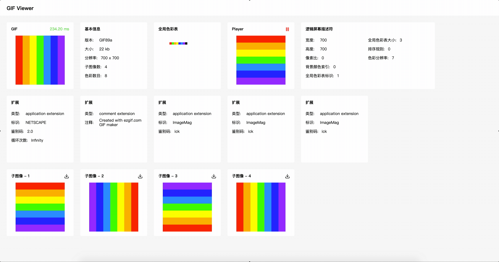

# Gif Viewer
解析并展示 GIF 文件

![github][github] ![npm][npm] ![jetBrains][jetBrains]



[github]:https://img.shields.io/github/license/WX-DongXing/vue-animation-timeline?style=flat&logo=github
[npm]:https://img.shields.io/npm/v/gif-viewer?style=flat&logo=npm
[jetBrains]:https://img.shields.io/badge/thanks-JetBrains-%23000?style=flat&logo=jetBrains

## 细节
https://www.notion.so/GIF-8a273f58d8a54d77a2e71c21422c2170

## 安装
```bash
yarn add gif-viewer
```

## 使用
```javascript
import GifViewer from 'gif-viewer'

const gifViewer = new GifViewer()

const gif = await gifViewer.decode(Blob | ArrayBuffer | File)
```

## 返回值
```javascript
const gif = {
    arrayBuffer: ArrayBuffer(7295),
    byteLength: 7295,
    extensions: [
        {
            application: {
                version: "NETSCAPE2.0",
                identifier: "NETSCAPE",
                authentication: "2.0",
                from: 1, to: 0
            },
            arrayBuffer: ArrayBuffer(19),
            byteLength: 19,
            name: "application extension",
            type: 2
        },
        {…}
    ],
    globalColorTable: {
        byteLength: 768,
        arrayBuffer: ArrayBuffer(768),
        colors: [
            [255, 255, 255],
            ...
        ]
    },
    header: {
        version: "GIF89a",
        arrayBuffer: ArrayBuffer(6),
        byteLength: 6
    }
    images: [
        {
            graphicsControlExtension: {
                byteLength: 8,
                delayTime: 10,
                name: "graphics control extension",
                packedField: {
                    reserved: 0,
                    disposalMethod: 2,
                    userInputFlag: 0,
                    transparentColorFlag: 1
                },
                transparentColorIndex: 255,
                type: 0
            },
            imageDescriptor: {
                arrayBuffer: ArrayBuffer(10),
                byteLength: 10,
                height: 66,
                left: 0,
                packedField: {
                    localColorTableFlag: 0,
                    interlaceFlag: 0,
                    sortFlag: 0,
                    reserved: 0,
                    localColorTableSize: 1
                },
                top: 0,
                width: 66
            },
            subImageData: {
                arrayBuffers: [
                    ArrayBuffer(255),
                    ArrayBuffer(255),
                    ArrayBuffer(255),
                    ArrayBuffer(255),
                    ArrayBuffer(255),
                    ArrayBuffer(23)
                ],
                byteLength: 1306,
                imageData: ImageData {
                    data: Uint8ClampedArray(17424),
                    width: 66,
                    height: 66
                },
                minCodeSize: 8
            }
        },
        {…},
        {…},
        {…},
    ],
    logicalScreenDescriptor: {
        byteLength: 7,
        arrayBuffer: ArrayBuffer(7),
        width: 66,
        height: 66,
        packedField: {
            colorResolution: 7,
            globalColorTableFlag: 1,
            globalColorTableSize: 8,
            sortFlag: 0
        }
    },
    trailer: ArrayBuffer(1)
}
```

## 引用
[GIF](https://zh.wikipedia.org/wiki/GIF)

[What's In A GIF](http://giflib.sourceforge.net/whatsinagif/index.html)

[spec-gif89a](https://www.w3.org/Graphics/GIF/spec-gif89a.txt)

[GIFOLOGY](http://www.theimage.com/animation/toc/toc.html)

[Graphics Interchange Format℠ Version 89a](https://web.archive.org/web/20160426201122/http://qalle.net/gif89a.php)
